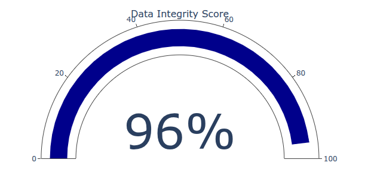
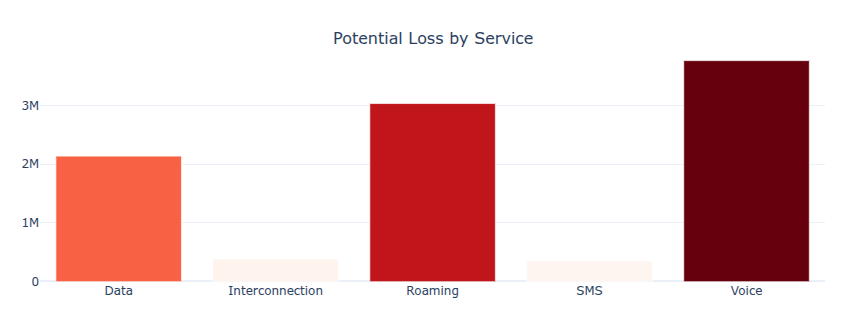
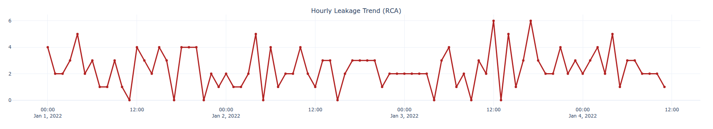

# Data Storytelling: Revenue Leakage Detection Insights
## Executive View: Reconciliation Usage vs Billing Analysis

This document provides a narrative walkthrough of the insights generated by the Revenue Assurance dashboard. It translates complex reconciliation data into actionable business intelligence, focusing on where, when, and why revenue leakage occurs.

---

### 1. Data Integrity Score (The Health Check)
* **Goal**: Measure the percentage of network traffic successfully billed.
* **Narrative**: "Our current integrity score is **96%**. 
  
  Given the scale of Telco operations, a 4% gap represents significant unbilled revenue. 
  
  Our industry target is **>99%**, making this our primary focus for system optimization."

### 2. Potential Loss by Service (Prioritization)
* **Goal**: Identify where the most value is being lost.
* **Narrative**: "While Data traffic has the highest volume, **Roaming** contributes the largest share of revenue leakage. 
  

  This suggests a synchronization issue with international partner settlement files (TAP files) rather than a local network failure."

### 3. Hourly Leakage Trend (Root Cause Analysis)
* **Goal**: Detect when the system fails.
* **Narrative**: "Notice the sharp spike in leakage at 02:00 AM. 

  This correlates exactly with the scheduled billing system backup window. **Recommendation**: We should implement a data buffer or shift the backup schedule to prevent CDR processing timeouts."

### Conclusion
By shifting from manual Excel-based audits to this Python-driven engine, we move from **Reactive Reporting** to **Proactive Revenue Recovery**, directly impacting the company's bottom line.
